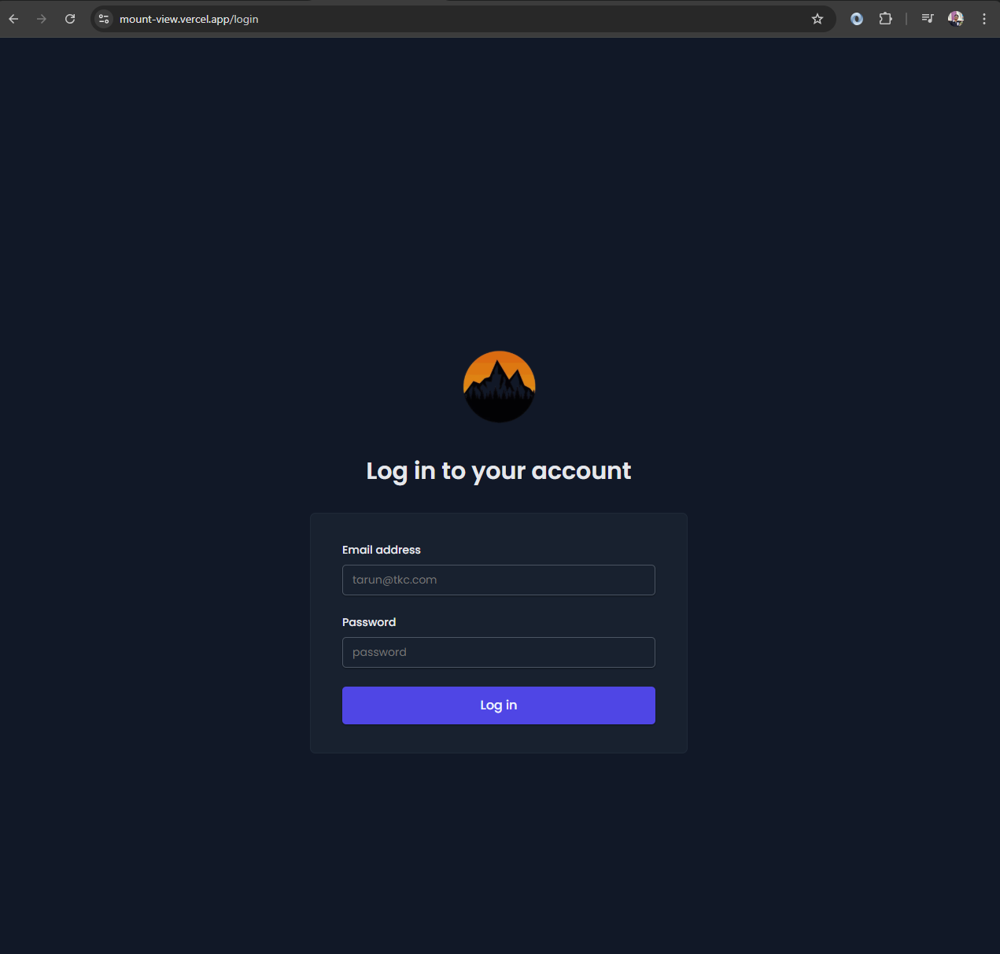
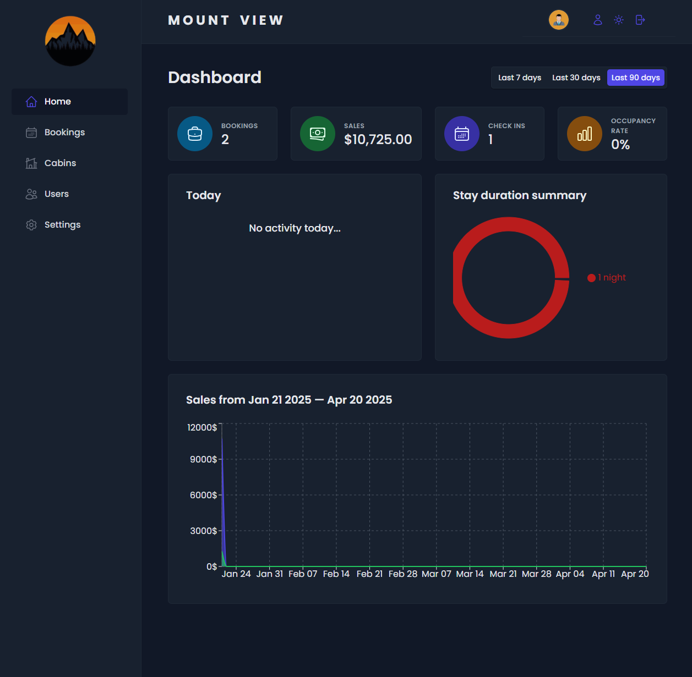
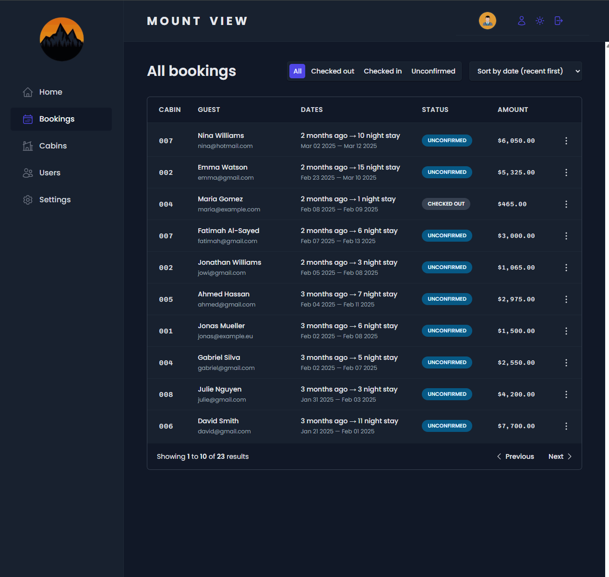
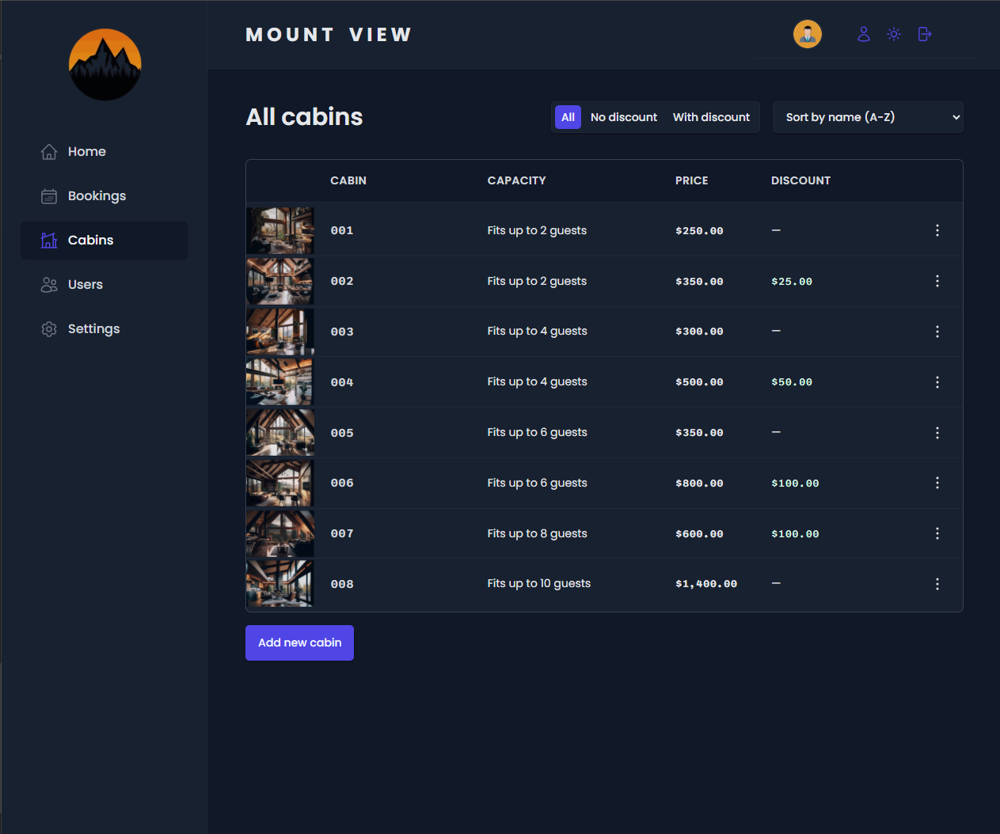
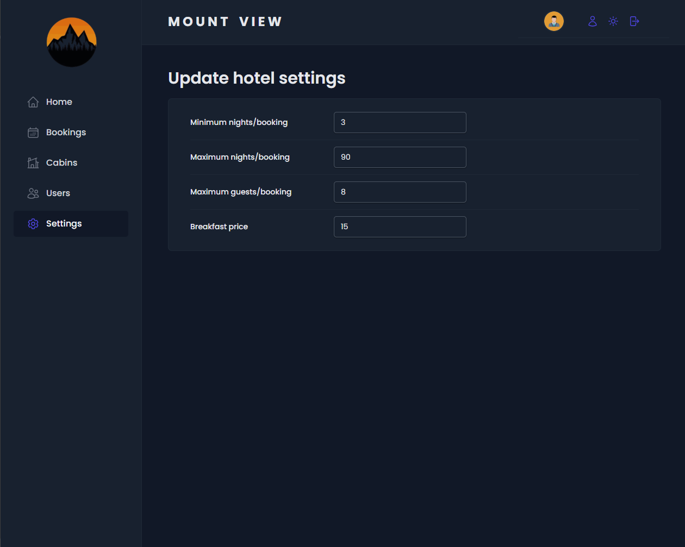

# 🏔️ Mount View – Internal Hotel Admin System

**Mount View** is a modern, single-page React + Vite application designed for managing hotel operations. Whether you're browsing bookings, managing guests, or searching availability — **Mount View** makes internal hotel admin simple, fast, and intuitive.

Built for performance and flexibility, it utilizes **React Query** for blazing-fast data fetching and caching, **Supabase** for powerful backend services, and **styled-components** for clean, scoped styling.

---

## 🌟 Overview

Mount View acts as the internal backbone of hotel operations — empowering staff to handle daily tasks with efficiency through a sleek, responsive UI.

From real-time data fetching to smooth routing and state management, it's engineered to feel lightweight yet powerful.

---

## ⚙️ Tech Stack

- **React Router** – Seamless single-page navigation
- **React Query** – Optimized data fetching & caching
- **Supabase** – Realtime database & auth backend
- **styled-components** – Scoped, elegant CSS-in-JS
- **Vite** – Lightning-fast dev experience & build

---

## 🚀 Features

✅ **Booking Management**  
Easily create, edit, or cancel room bookings in real time.

✅ **Search & Filter**  
Quickly search guests, rooms, and past stays with intuitive filters.

✅ **Live Data Sync**  
Powered by Supabase to ensure the data is always fresh and synchronized.

✅ **Responsive UI**  
Optimized for all screen sizes — from desktop dashboards to tablet check-ins.

✅ **Modular Architecture**  
Component-based structure for scalability and easy maintenance.

✅ **Secure Access**  
Authentication and user roles managed through Supabase Auth.

---

## 📸 Screenshots

  
  
   
  
  
  

